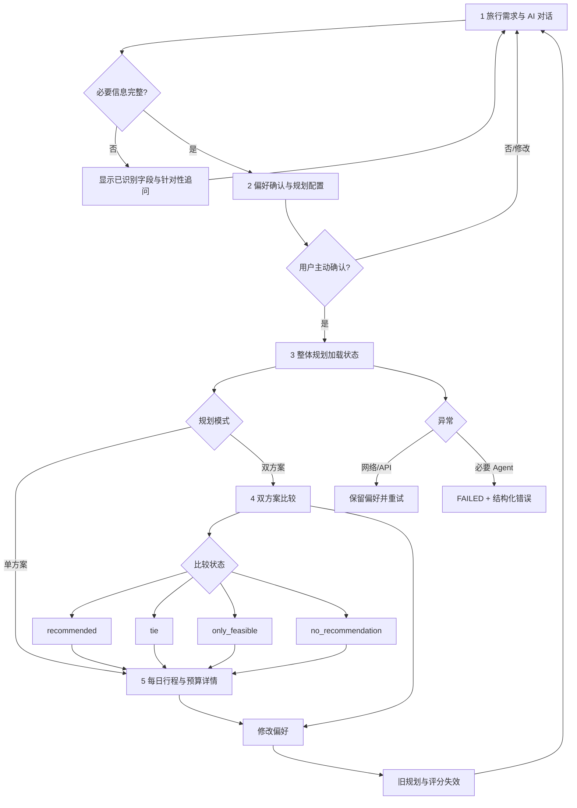

# 阶段 D1：信息架构、视觉规范与交互原型说明

## 1. 产品设计方向

### 1.1 设计命题

将当前“功能演示页”升级为一个可靠的 AI 旅行规划工作台。用户的核心任务不是观看 Agent 技术，而是逐步完成：表达需求、确认约束、等待规划、理解方案差异、查看每日细节。

### 1.2 视觉方向

- **世界：** 行程工作台、路线图、登机信息与旅行手册。
- **材质：** 轻量地图网格、行程节点、票据式数据块、清晰的状态印章。
- **签名元素：** 左侧“旅行路线脊柱”。五个节点对应真实流程状态；完成、当前和未来步骤同时可见。
- **克制原则：** 大胆只放在路线脊柱与标题排印上。卡片、表格和状态保持安静，避免装饰影响复杂业务信息。

## 2. 用户操作流程图



## 3. 五个主要界面

| 页面 | 首要任务 | 主内容 | 核心动作 | 不在本页做的事 |
|---|---|---|---|---|
| 1 需求与对话 | 完成信息收集 | 左侧对话、右侧实时偏好摘要 | 发送、补充、重启、切换结构化输入 | 不允许信息不完整时规划 |
| 2 偏好确认 | 核对硬约束 | 日期语义、完整偏好、单/双模式 | 修改、主动确认并规划 | 不静默修正冲突 |
| 3 规划执行 | 理解等待与失败 | 整体加载、固定依赖顺序、错误恢复 | 等待、返回、保留偏好重试 | 不伪造 Agent 实时百分比 |
| 4 双方案比较 | 快速理解取舍 | 两方案卡、四维事实、解释、权重 | 查看详情、产品内选择 | 不在前端重算评分 |
| 5 行程与预算 | 检查每天和费用 | 天气—活动时间轴、交通住宿、费用、证据 | 切换方案/详情视图 | 不把查看选择描述成预订 |

### 页面层级

```text
旅行工作台
├─ 路线脊柱：五步状态 + Mock 印章
├─ 全局顶栏：当前位置 / Mock 标识 / 状态预览
└─ 当前页面
   ├─ 页面任务与说明
   ├─ 主操作区
   └─ 渐进展开的证据与明细
```

## 4. 关键交互规则

### 4.1 偏好与结果失效

| 事件 | 必须清除 | 必须保留 |
|---|---|---|
| 修改任一必要偏好 | 旧规划、比较、评分、用户方案选择、旧确认状态 | 新草稿、对话历史、错误说明 |
| 重新开始 | 当前草稿、历史、回执、规划和比较 | 日期基准可重置为新会话值 |
| 网络超时 | 不清除任何已确认偏好 | 草稿、回执、历史、模式和上次有效结果 |
| API 业务不可行 | 不伪装成功、不自动修改偏好 | 完整业务状态、调整历史、约束问题 |

### 4.2 比较状态

- `recommended`：两套均可行且证据集合一致；显示条件化推荐、分差和费用取舍。
- `tie`：达到并列阈值；并列文本优先于分数排序。
- `only_feasible`：只推荐完整可行方案；不可行方案显示真实状态且不显示综合分。
- `no_recommendation`：只展示可验证事实、缺失指标和原因，不强行推荐。

### 4.3 异常文案与下一步

| 状态 | 标题 | 说明 | 下一步 |
|---|---|---|---|
| 天气 unavailable | 天气数据不可用 | 使用基础规划，不显示晴天、不宣称天气验证 | 继续查看，标记局限 |
| Provider timeout | 天气请求超时 | 明确 timeout 降级，不等同普通 unavailable | 重试或查看基础规划 |
| 预算不可满足 | 当前策略未找到预算内方案 | 不宣称所有组合数学无解 | 查看调整历史或修改预算 |
| 活动/pace 无解 | 必要约束下没有真实候选 | 不编造活动、不放宽约束 | 修改日期、兴趣或 pace |
| Agent failure | 规划执行失败 | 缺失费用不按 0 元 | 保留偏好重试 |
| 网络错误 | 无法连接规划服务 | 草稿和确认状态未丢失 | 服务恢复后重试 |

## 5. 视觉设计规范

### 5.1 色彩

| Token | 色值 | 用途 |
|---|---|---|
| Ink | `#162434` | 主文字、深色控制、可信基调 |
| Route teal | `#0F766E` | 当前路线、主要动作、成功语义 |
| Coral | `#D85A43` | 第二方案、关键差异，不作为默认错误色 |
| Sun | `#E3AD37` | 警告、约束提示 |
| Sky | `#2E7899` | 天气数据与辅助信息 |
| Paper | `#F7FAF9` | 带地图网格的页面背景 |
| Mist / Line | `#EAF1F2` / `#D5E0E2` | 分组、轨道、边界 |

成功、警告、失败和未知状态必须同时使用图标、状态词和说明，不能只依赖色彩。

### 5.2 字体与数字

- 展示标题：系统 `Aptos Display` + 中文系统字体，紧凑字距，32–56 px。
- 正文：`Microsoft YaHei UI`，14–16 px，正文行高 1.6–1.8。
- ID、版本、时间和百分比：`Cascadia Mono` / `Consolas`，10–12 px。
- 金额统一使用 `¥`、千分位和后端精度；同一页面不混用整数与两位小数口径。

### 5.3 栅格与间距

- 桌面：264 px 路线栏 + 自适应工作区；内容最大宽度 1340 px。
- 主内容边距：24–58 px；卡片间距 20–22 px。
- 卡片圆角：14 / 20 / 28 px 三档；阴影仅用于主任务容器和方案卡。
- 比较卡使用完全相同的字段顺序和基线，禁止因状态不同移动核心金额位置。

### 5.4 核心组件

1. **Route rail：** 五步导航，显示完成/当前/未来；窄屏变为横向可滚动步骤条。
2. **Preference dossier：** 字段值 + 来源，缺失与推导清楚区分。
3. **Status pill：** 图形点、文本和语义背景三者并存。
4. **Plan card：** 状态、费用、余额、四维评价、综合分资格和动作。
5. **Evidence block：** 显示 ExplanationService 文本，证据链按需展开。
6. **Day timeline：** 日期天气与 morning/afternoon/evening 或休息时段放在同一时间轴。
7. **Budget ledger：** 航班/酒店/活动/总额/预算以及 adjustment history。
8. **Loading / Empty / Error：** 每个状态必须解释发生了什么、哪些数据保留、下一步是什么。

## 6. 响应式与可访问性

### 桌面（≥ 980 px）

- 固定左侧路线栏；对话与偏好摘要、详情与天气侧栏采用双列。
- 双方案卡并排，所有指标行对齐。

### 中窄屏（700–979 px）

- 路线栏变为顶部横向步骤条；顶栏保持当前位置和状态预览。
- 主内容全部单列；偏好摘要移动到对话下方。

### 手机宽度（< 700 px）

- 双方案卡纵向排列；比较状态切换可横向滚动。
- 日期语义使用 2×2 网格；按钮点击目标不小于 42 px。
- 时间轴金额换行到内容列，避免压缩活动名称。

### 可访问性要求

- 所有输入必须有显式标签；图标 SVG 使用 `aria-hidden`，按钮本身有可读文本。
- 对话区、状态抽屉和修改确认使用合适的 landmark / dialog 语义。
- 键盘焦点使用 3 px 可见外框；支持 `prefers-reduced-motion`。
- 任何 `—` 必须配套“不可评价/数据不足”说明，不能让用户猜测。

## 7. Streamlit 可行性

当前 Streamlit 版本为 1.64.0，已具备 `st.navigation`、`st.segmented_control`、`st.status` 和 `st.dialog`。D2 可以实现主要信息架构，但存在边界：

- 可以：五步页面状态、分段控制、统一卡片容器、整体 loading、dialog、会话隔离和响应式列堆叠。
- 可以但需克制：少量 CSS 设计 token 和静态 HTML 状态标签；避免依赖 Streamlit 内部自动生成 class 名。
- 不适合：真正自由布局、拖拽、复杂动画、稳定的移动端底部导航。
- 后端没有进度事件前，`st.status` 只能表达整体请求，不能显示虚假的 Agent 实时进度。

## 8. 高保真原型

入口：`prototypes/stage-d1-travel-workbench/index.html`

原型为零外联、无构建依赖的本地 HTML/CSS/JavaScript，使用 C3 固定 Fixture 示例，不调用 API、不包含规划或评分算法。覆盖：

- 初始输入、多轮澄清、偏好确认和单/双模式。
- 整体规划加载与无伪进度说明。
- recommended、tie、only_feasible、no_recommendation。
- 单方案/双方案详情、天气时间轴、费用和证据。
- 天气不可用、预算不可满足、Agent 失败、网络错误。
- 修改偏好使旧结果失效；失败后保留偏好重试。

安全审查后，原型没有加载第三方脚本、字体、图片或其他网络资源。旅行视觉通过本地 CSS 网格、路线节点和手写 SVG 图标实现。
