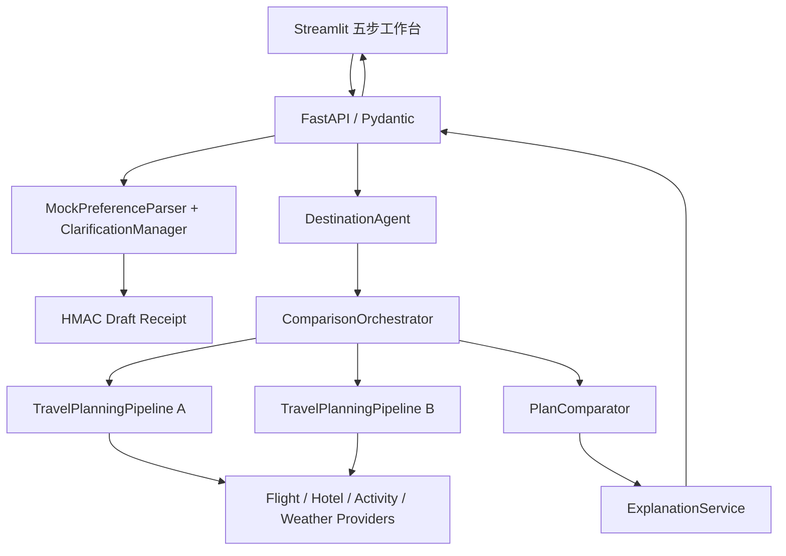
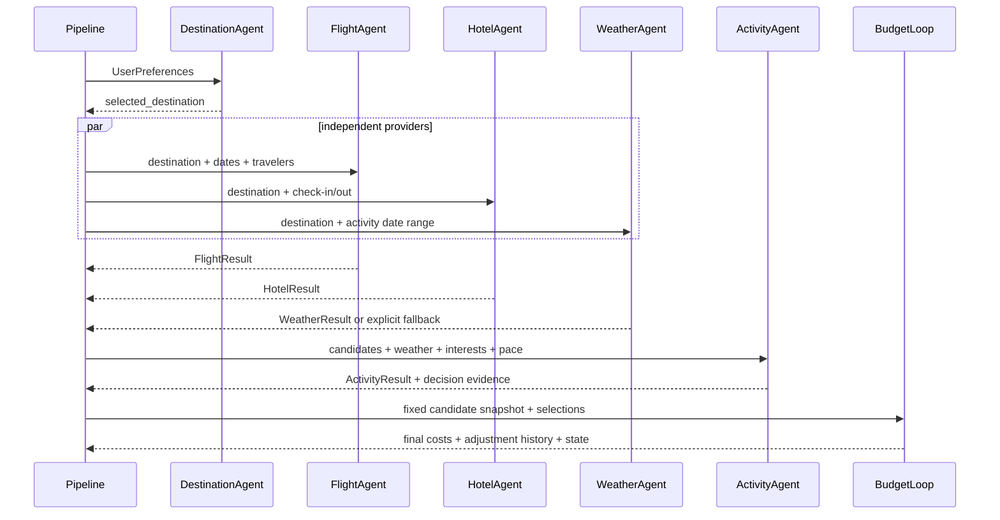

# Multi-Agent Travel Copilot 最终系统架构、API 与复现指南

## 1. 系统架构



分层职责：Provider 查询或生成候选；Agent 评分与业务选择；Pipeline 管理依赖和失败传播；
ComparisonOrchestrator 建立独立状态；API 校验契约；Streamlit 只展示并管理浏览器会话。

## 2. 单方案 Agent 数据流



## 3. 双方案数据流

ComparisonOrchestrator 只执行一次目的地候选获取；对每个目的地创建新 Pipeline 和深拷贝
偏好。一个方案失败不会删除另一方案。PlanComparator 只读 MultiPlanResult，不查询
Provider、不重新规划、不修改候选。ExplanationService 使用结构化模板引用同一评价证据。

## 4. 核心数据契约

- PreferencesDraft / ClarificationResult：未完成偏好与字段来源。
- UserPreferences：正式规划输入，pace 可选；未指定保持旧行为。
- TravelPlanState：目的地、各 Agent 结果、业务状态、费用、快照、错误与历史。
- WeatherSearchRequest / DailyWeather / WeatherResult：结束日期排除、逐日可用性。
- CandidateSnapshot / BudgetAdjustment：稳定候选、原价和累积调整证据。
- MultiPlanRequest / DestinationPlan / MultiPlanResult：独立双方案编排。
- MetricEvaluation / PlanEvaluation / PlanComparisonResult：评分、有效权重、证据与推荐。

## 5. 正式 API

### 偏好

POST /api/preferences/parse 接收 text、reference_date、Parser 配置；返回草稿、缺失项、
问题、日期摘要和回执。

POST /api/preferences/clarify 接收上一轮完整草稿、回执、回答和相同上下文；服务端验证后
合并。

POST /api/preferences/plan 与 /api/preferences/compare 要求 confirmed=true，验证回执、
完整性和领域规则后分别启动单/双方案。

### 结构化规划

POST /api/plan/full 返回完整 TravelPlanState；POST /api/plans/compare 接收：

```json
{
  "preferences": {
    "budget": 15000,
    "departure_city": "上海",
    "start_date": "2026-10-01",
    "end_date": "2026-10-06",
    "travel_style": "comfort",
    "pace": "relaxed",
    "num_travelers": 3,
    "interests": ["摄影", "美食"]
  },
  "plan_count": 2,
  "config": {"execution_mode": "concurrent", "max_concurrency": 2}
}
```

响应的 multi_plan 保存原始方案，comparison 保存主策略评价，sensitivity 保存声明的
替代权重结果。不要用 request_status 覆盖每个方案的 status。

## 6. 本地启动

要求 Python 3.11+。在 python/ 目录：

```bash
python -m venv .venv
# Windows: .venv\Scripts\activate
# macOS/Linux: source .venv/bin/activate
pip install -r requirements.txt
copy .env.example .env
python -m uvicorn api.app:app --host 127.0.0.1 --port 8000
```

另开终端：

```bash
cd python
set TRAVEL_API_BASE_URL=http://127.0.0.1:8000
python -m streamlit run ui/streamlit_app.py --server.port 8501
```

macOS/Linux 用 export 设置环境变量。默认 Mock 模式不需要真实 API Key。若跨进程验证偏好
回执，应设置私有随机 PREFERENCE_DRAFT_SIGNING_KEY；不得提交 .env 或密钥。

## 7. 测试与实验复现

```bash
cd python
python -m pytest -q
python experiments/run_preference_experiment.py
python experiments/run_weather_awareness_experiment.py
python experiments/run_pace_planning_experiment.py
python experiments/run_plan_comparison_experiment.py
python experiments/run_comparison_product_experiment.py
python experiments/summarize_d3_evidence.py
```

若直接执行脚本时本地环境未把 python/ 加入模块路径，应显式把当前 python/ 目录加入
PYTHONPATH。

真人研究模板为空时：

```bash
python experiments/analyze_usability_results.py \
  ../docs/templates/D3-用户可用性测试记录模板.csv
```

应返回 pending_real_participants，而不是虚构统计。

## 8. 演示顺序

1. 输入不完整自然语言并回答一次追问。
2. 在确认页解释日期、住宿晚数和 relaxed pace。
3. 生成双方案，展示 recommended / tie / only_feasible / no_recommendation 之一。
4. 展开详情，指出天气决策、休息时段和预算调整。
5. 修改预算，说明旧结果立即失效。
6. 使用固定验收场景说明天气 unavailable 与 Agent FAILED 不同。

## 9. 安全与运行边界

- HMAC 只保护草稿完整性，不证明特定自然人的身份。
- 普通客户端不能提交服务端评分或推荐 ID 覆盖比较结果。
- 固定天气演示端点默认关闭且不出现在 OpenAPI。
- Mock 候选不是真实库存；UI 中的选择不是预订。
- 真实 Provider 接入必须增加凭据管理、限流、时效、隐私和供应商错误策略。
