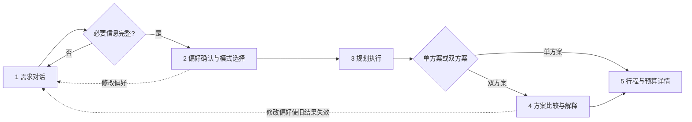

# Multi-Agent Travel Copilot 最终 PRD

版本：Final Mock MVP 
日期：2026-09-26

## 1. 产品定位

Multi-Agent Travel Copilot 是一个可解释的旅行规划工作台。它先通过自然语言和多轮澄清
形成可验证偏好，再生成一套或两套独立方案；天气、旅行节奏和预算约束实际参与活动选择，
双方案评价保留证据和不可推荐边界。

当前产品是本地确定性 Mock MVP，用于展示 AI 产品设计、数据契约、Agent 编排、异常处理、
实验设计与工程验收。它不是实时旅行搜索、真实 LLM 服务或预订平台。

## 2. 目标用户与核心问题

目标用户是希望快速梳理旅行需求、比较目的地并理解推荐依据的自助旅行者，以及评审 AI
产品设计与工程实现的面试官/项目协作者。

原产品的主要问题：结构化表单要求用户一次性给齐信息；天气未进入活动决策；只给一个方案
且缺乏可追溯解释；预算曾有静默成功和直接改价风险；页面难以承载完整业务状态。

## 3. 产品目标与非目标

### 目标

- 缺失和歧义信息通过多轮澄清解决，不用默认值掩盖。
- 相同输入、配置和数据版本产生可复现结果。
- 天气、pace 和预算对行程有可验证影响。
- 两个目的地独立规划，失败互不污染。
- 推荐由声明过的规则和真实方案数据驱动，允许并列或不推荐。
- UI 清晰区分成功、业务不可行、数据不可用和程序失败。

### 非目标

- 不调用真实 LLM、实时天气、航班、酒店、活动库存或付费 API。
- 不提供账户、支付、预订和订单履约。
- 不声称固定规则语料代表开放域理解能力。
- 不使用综合分覆盖预算或活动硬约束。

## 4. 五步用户流程

1. 用户输入中文自然语言或切换结构化表单。
2. Mock Parser 只提取明确支持的信息；ClarificationManager 追问缺失/冲突字段。
3. 用户核对出发、返程、活动日期、住宿晚数、人数、预算、风格、兴趣和 pace，并主动确认。
4. 系统生成单方案，或生成两个独立目的地方案并做四维评价。
5. 用户查看天气、活动、休息、交通住宿、预算调整和解释，可在双方案间切换而不重新规划。

## 5. 核心功能需求

### 5.1 偏好澄清

- PreferencesDraft 保存字段值、explicit / inferred / unknown 来源和歧义。
- 普通缺失是业务结果，不是服务器错误。
- 相对日期必须有显式 reference_date。
- 草稿经 HMAC 回执绑定内容、日期基准和 Parser 配置；修改后旧回执失效。
- 只有完整、合法、用户主动确认的草稿才能转换成 UserPreferences。

### 5.2 单方案规划

    Destination
      -> Flight + Hotel + Weather（并行）
      -> Activity（等待天气状态）
      -> BudgetLoop（活动 -> 酒店 -> 航班候选重选）

预算优化只从稳定候选快照重选，保留原价、candidate_id 和调整历史；不得打折或制造候选。

### 5.3 天气与旅行节奏

- 天气数据按活动日期覆盖，结束日期排除。
- unavailable 和 timeout 可显式回退到基础规划，但不能显示为晴天。
- 非法数据和内部错误按结构化故障处理。
- 活动先满足城市、日期、时段、兴趣和天气硬约束，再做软评分。
- relaxed 允许明确休息；balanced 保留三时段；packed 允许高强度但不虚构额外容量。
- 预算重选不得破坏天气、兴趣或 pace 硬约束。

### 5.4 双方案比较

- DestinationAgent 只运行一次，稳定选取最多两个不同候选。
- 每个目的地有独立 TravelPlanState、候选快照和预算历史；每套都使用完整用户预算上限。
- 四维评价：预算 30%、兴趣 30%、pace 25%、天气 15%，版本 plan-scoring-v1。
- 缺失指标不默认计 0；只有共同可评价维度才可使用一致有效权重。
- 决策类型：recommended、tie、only_feasible、no_recommendation。
- 解释必须引用费用、统计量、状态或候选证据；前端不得重算评分。

## 6. 业务状态

| 状态 | 含义 | UI 行为 |
|---|---|---|
| COMPLETED | 满足必要约束且预算内 | 展示完整方案 |
| BUDGET_INFEASIBLE | 当前候选与分阶段搜索未找到预算内方案 | 展示真实费用和调整历史，不宣称全局无解 |
| ACTIVITY_CONSTRAINTS_UNSATISFIED | 某日期/时段无天气合规真实活动 | 不编造活动 |
| PACE_CONSTRAINTS_UNSATISFIED | 候选池无法满足已确认 pace | 不放宽未授权约束 |
| FAILED | 必要 Agent 或内部执行失败 | 展示结构化 Agent、类型和原因 |

HTTP 200 只表示请求已处理，不代表所有业务方案均成功。

## 7. 产品与数据要求

- 所有 Mock 记录带 source、source_version、is_mock 或等价标识。
- 金额由真实选中候选对账，航班乘人数，酒店乘晚数和房间数，活动乘人数。
- 相同输入连续、并发和跨进程结果一致；返回对象深拷贝隔离。
- 未知属性保持未知，不默认视为低强度、室内或雨天安全。
- API、比较卡、解释、详情和预算展示必须使用同一份后端结果。

## 8. 接口范围

- POST /api/preferences/parse
- POST /api/preferences/clarify
- POST /api/preferences/plan
- POST /api/preferences/compare
- POST /api/plan、POST /api/plan/full
- POST /api/plans/compare
- GET /api/health

固定天气验收接口默认 404，仅在显式环境开关下启用，不属于普通用户 API。

## 9. 成功指标与证据

固定 Mock 实验重算结果：偏好场景收集 8/8；支持字段 51/51；自然语言与结构化规划一致
8/8；天气冲突由 33/63 降为 0/60，同时兴趣和预算指标体现真实代价；C3 评价证据 30/30，
状态识别与解释一致均 7/7。详见[最终实验汇总](24-最终产品实验与证据汇总.md)。

这些指标只用于规则与产品契约验收。真人可用性数据尚未收集，不能报告满意度或真实任务效率。

## 10. 已实现与未实现

已实现：多轮澄清、签名确认、单/双方案、确定性 Provider、WeatherAgent、pace、预算候选
重选、四维评价、证据解释、五步 Streamlit、异常状态和自动化/服务验收。

未实现：真实模型和供应商、账户与持久化、真实预订、时段级天气、全球目的地与开放域语料、
生产监控、真人可用性结论。

## 11. 后续路线

1. 先完成 3～5 人可用性测试，基于观察而非假设调整文案和导航。
2. 以现有 Protocol 接入沙箱/免费真实天气，保留 unavailable 和来源版本。
3. 接入真实 LLM Parser 前建立离线语料、隐私和提示注入防护。
4. 航班/酒店真实 Provider 使用供应商 sandbox，增加限流、缓存和价格时效。
5. 加入账户与持久化前重新设计身份、同意、删除和跨会话安全。
