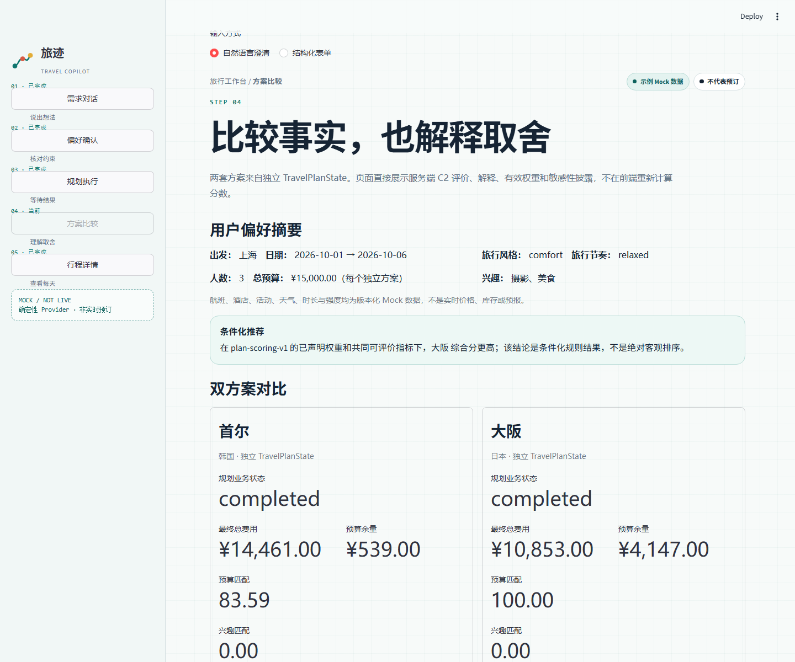
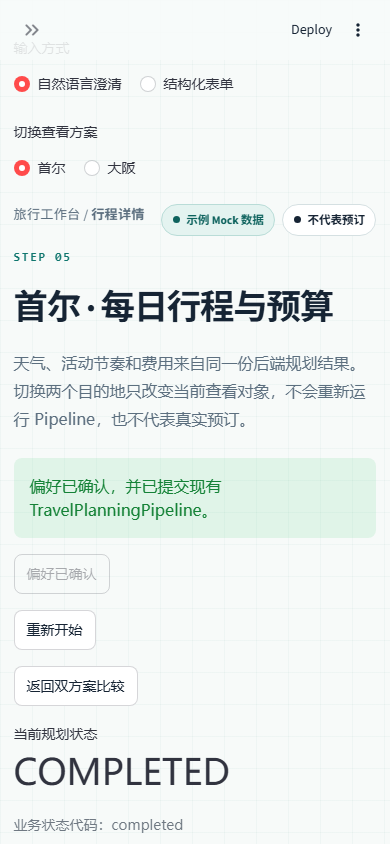

# AI 产品经理作品集：Multi-Agent Travel Copilot

## 一句话项目

把一个只能填表、只给单一答案的旅行规划 Demo，改造成支持自然语言澄清、天气与旅行节奏
约束、候选级预算优化、双方案比较和可追溯推荐的完整 Mock 产品工作台。

## 1. 背景与问题

原始版本具备多 Agent 雏形，但存在四类产品风险：

- 用户必须一次性填写结构化字段，缺失/错误信息可能被默认值掩盖。
- 天气数据与活动推荐脱节，难以证明“智能”改变了行程。
- 超预算处理缺少真实候选闭环，失败和成功边界不清晰。
- 只输出一个方案，缺少选择空间、评价依据和不可推荐边界。

我把目标拆成阶段 0/A/B/C/D，每阶段先定义数据契约、Acceptance Criteria 和实验口径，再
实施功能、回归和产品验收。

## 2. 我的工作

### 产品设计

- 定义五步用户流程：需求对话、偏好确认、规划执行、方案比较、行程详情。
- 设计 COMPLETED、BUDGET_INFEASIBLE、活动/pace 约束不可满足和 FAILED 的差异化语义。
- 设计四维评价和 recommended、tie、only_feasible、no_recommendation 决策。
- 规定 Mock、非实时、非预订和证据边界，防止把演示能力包装成真实服务。

### 数据与工程协作

- 将 Agent 输入输出改为 Pydantic 契约，引入稳定 candidate_id、来源和数据版本。
- 统一 Flight、Hotel、Activity、Weather Provider 边界，支持未来替换真实服务。
- 设计 HMAC 草稿回执，阻止客户端篡改已确认偏好后继续提交。
- 将天气、pace 和预算约束贯穿 ActivityAgent 与 BudgetOptimizer。
- 为双目的地建立独立 TravelPlanState，保证候选、天气和预算历史隔离。

### 实验与验收

- 为偏好、天气、pace 和比较建立固定场景、原始 JSON 和统计脚本。
- 区分自动化 Mock 实验、真实 HTTP/浏览器验证和真人研究三层证据。
- 使用 FastAPI、Streamlit AppTest 和 Edge 完成桌面/390×844 实际流程。
- 准备 3～5 人可用性任务、观察表和统计器；没有参与者数据时明确标记待执行。

## 3. 核心方案

### 自然语言澄清

MockPreferenceParser 只处理声明支持的中文表达，PreferencesDraft 保存 explicit、inferred
和 unknown。ClarificationManager 不重复追问已明确字段；日期冲突、非法预算和人数不能
进入正式 Pipeline。用户确认后，服务端再次校验 HMAC 回执和完整性。

固定 8 场景中，必要字段收集 8/8、已支持字段 51/51、自然语言与结构化规划一致 8/8。
这些数字只表示固定规则语料覆盖，不是 LLM 泛化准确率。

### 天气与旅行节奏

WeatherAgent 与航班、酒店并行，ActivityAgent 等待天气状态。WeatherCompatibilityEvaluator
统一处理晴天、降雨、强降雨和未知天气；unknown 不会被当作雨天安全。relaxed 安排 1～2
项活动和明确休息，balanced 保留三时段，packed 允许高强度候选。

天气 Treatment 把可评价活动冲突从 33/63 降到 0/60，但兴趣匹配从 91.30% 降至
72.73%，预算合规从 92.31% 降至 84.62%。这说明功能有效，也有候选供给和费用代价。

### 候选级预算闭环

预算优化不修改商品价格，而是保留固定候选快照，依次重选活动、酒店和航班。每轮记录前后
candidate_id、费用、节省、当前总价和剩余预算。三轮仍超预算时返回明确业务状态；必要
Agent 失败时不把缺失结果按 0 元计算。

### 双方案与可解释推荐

DestinationAgent 只运行一次；两个目的地分别执行完整 Pipeline。PlanComparator 在只读结果
上计算预算、兴趣、pace、天气四维指标，缺失指标不默认计 0；硬约束不可行的方案不能靠
加权分成为普通推荐。

C3 固定 7 场景中，评价证据 30/30、解释一致与状态识别均 7/7。权重敏感性实验中，预算与
兴趣各移动 5 个百分点使一个结果从 recommended 变为 tie，因此产品显式披露敏感性。

## 4. 最终体验

工作台保持 Mock Parser、Mock 数据和非预订提示常驻。比较页并列展示状态、实际费用、四维
指标和正式推荐；详情页展示每日天气、活动强度、休息、预算历史和候选证据。修改偏好会让
旧规划失效；网络错误不会删除有效草稿。

## 5. 产品实验结果

| 能力 | 可验证结果 | 边界 |
|---|---|---|
| 偏好澄清 | 固定场景收集 8/8，支持字段 51/51 | 非开放域 LLM |
| 天气规划 | 冲突 52.38% → 0% | 可能降低兴趣/预算指标 |
| pace | relaxed 产生休息，packed 选择高强度 | 非真实舒适度 |
| 双方案 | 证据 30/30，状态 7/7 | 固定 Mock 场景 |
| 浏览器 | 桌面与 390×844 全链路通过 | 非真人可用性研究 |

## 6. 关键取舍

- 先用确定性 Mock 做可复现实验，再接真实服务；代价是不能证明市场准确性。
- 对天气使用硬约束会提高安全一致性，但候选不足时可能更贵或无解。
- 四维总分便于比较，但不应覆盖硬约束；因此保留 only_feasible 与 no_recommendation。
- Streamlit 加快端到端验证，但路由、响应式和细粒度进度能力有限。
- HMAC 证明草稿未被篡改，不等于用户身份认证。

## 7. 复盘与下一步

做得好的部分是把“AI 功能”转成可验证决策记录，而不是只生成好看的文本；同时用失败状态
和证据边界约束产品叙事。下一步应先执行 3～5 人可用性测试，验证用户能否理解追问、并列、
天气不可用和条件化推荐；随后再接入有 sandbox 的真实天气与供应商 Provider，并重新建立
时效、隐私、限流和离线评测。

## 8. 可核对交付物

- [最终 PRD](25-Multi-Agent-Travel-Copilot最终PRD.md)
- [架构/API/复现指南](26-最终系统架构API与复现指南.md)
- [实验与证据汇总](24-最终产品实验与证据汇总.md)
- [UI/UX 检查报告](22-产品UIUX最终检查报告.md)
- [真人测试方案](23-真实用户可用性测试方案.md)
- [D3 技术验收报告](29-阶段D3最终产品验收报告.md)

项目没有真实上线用户、收入或满意度数据；本人贡献以仓库中的设计、代码、测试、实验和报告
为证，不虚构团队规模。
